<div align="center">

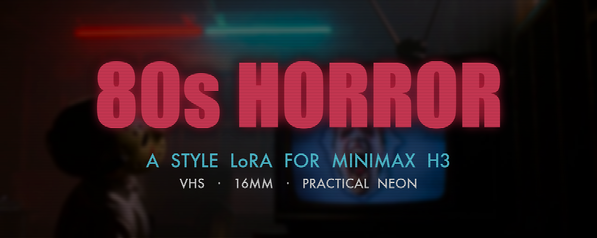

<p align="center">
  <a href="LICENSE"></a>
  <a href="WEIGHTS_LICENSE.md"></a>
  <a href="../../releases"></a>
  
  <a href="https://ko-fi.com/samwasserman"></a>
</p>

**Give any MiniMax H3 prompt the look of a 1970s–80s horror movie.** VHS or grindhouse 16mm, practical neon and tungsten light, period wardrobe and sets, from one trigger word.

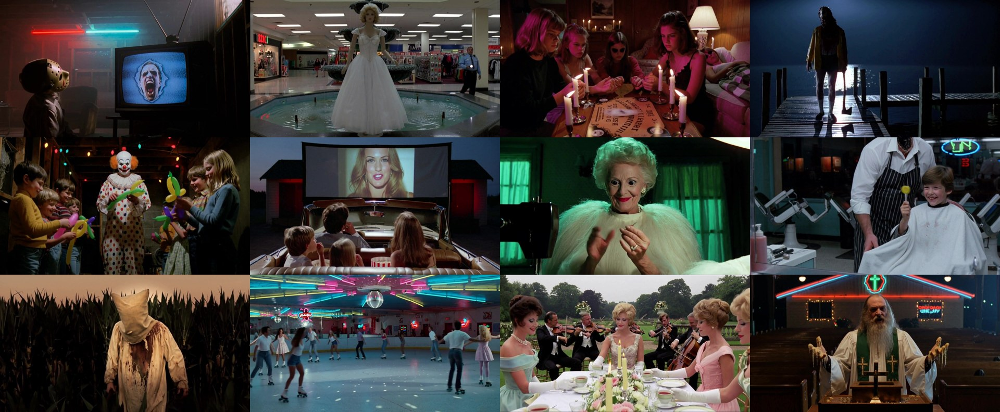

</div>

---

This is a style LoRA for **MiniMax H3**, the open video-and-audio model. Put `80s_horror_wk` at the start of your prompt and H3 renders the scene like a lost tape from 1984 or a drive-in print from 1978. You write the scene; the LoRA brings the era.

- 📼 **Two formats, one trigger:** `shot on VHS.` for neon, tape and 80s video, or `shot on 16mm film.` for warm grindhouse grain.
- 🎬 **Keeps your scene:** it changes the look, not your story. Characters, action and dialogue play out as you prompt them.
- 🧩 **Plug and play in ComfyUI:** one-line installer, plus ready-made text-to-video and image-to-video workflows.
- 🔊 **Audio-friendly:** trained on clips with their sound, so H3's dialogue and diegetic audio keep working.
- 🆓 **Free.** The workflows, installers and docs are Apache 2.0; the weights follow the MiniMax H3 Community License.

## See it

<table>
<tr>
<td width="50%" align="center">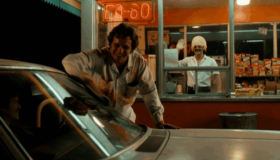<br><sub><code>shot on 16mm film.</code> · 1344×768</sub></td>
<td width="50%" align="center">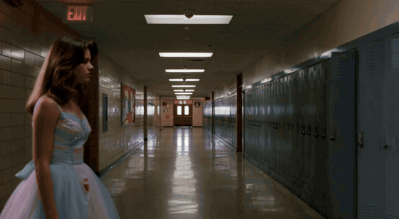<br><sub><code>shot on VHS.</code> · 1280×704</sub></td>
</tr>
</table>

**H3 alone vs. with the LoRA:** same prompt, same seed, same settings.

| MiniMax H3 | + 80s Horror LoRA |
|---|---|
| 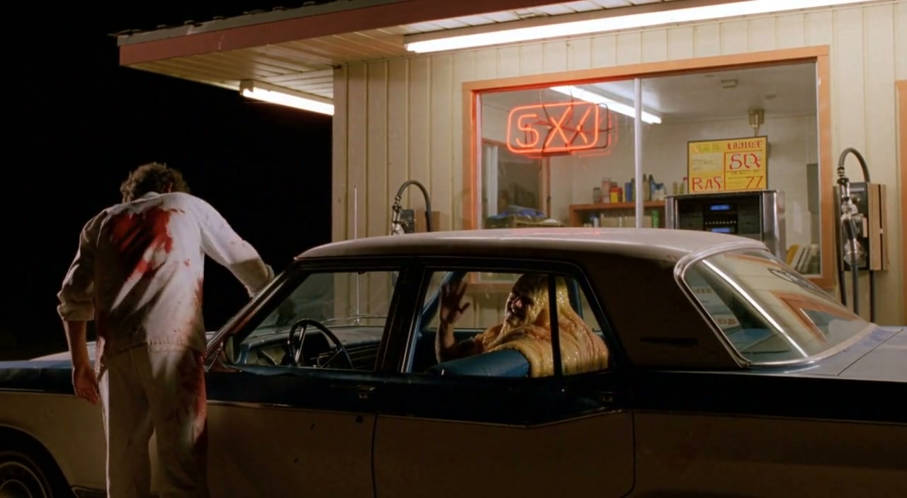 | 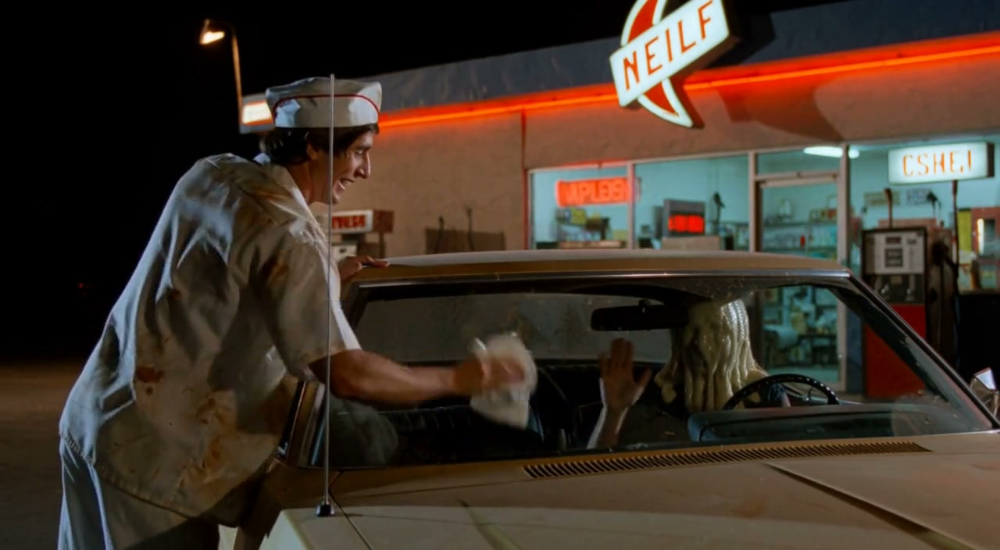 |
| 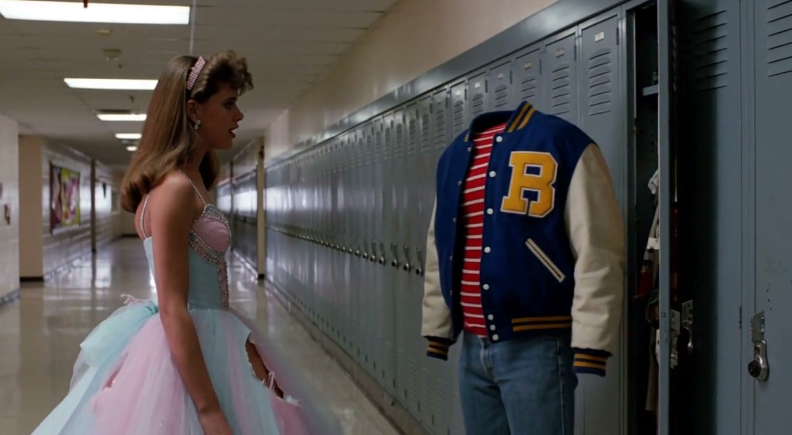 | 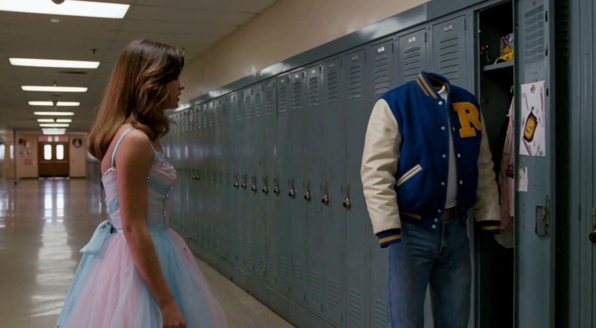 |

**Works with the standard H3 text encoder** (`qwen3vl_32b_minimax_h3_nvfp4_awq`), the one the installer sets up. **Image to video** keeps your start frame and pushes the action, wardrobe and set dressing toward the era.

| Standard H3 setup + LoRA | Image to video + LoRA |
|---|---|
| 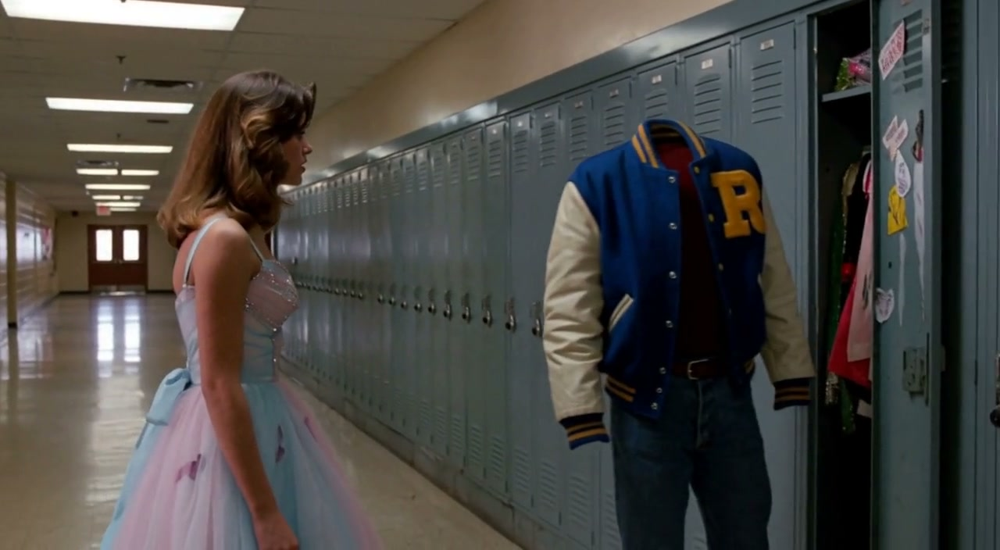 | 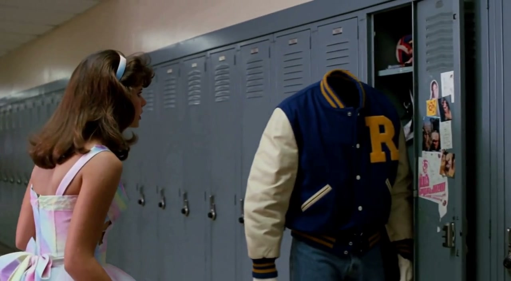 |

## Install (ComfyUI)

**macOS / Linux, one line:**

```bash
curl -fsSL https://raw.githubusercontent.com/wassermanproductions/wasserman-80s-horror-lora/main/install.sh | bash
```

**Windows (PowerShell), one line:**

```powershell
irm https://raw.githubusercontent.com/wassermanproductions/wasserman-80s-horror-lora/main/install.ps1 | iex
```

The installer finds your ComfyUI folder and does three things:
1. It puts `80s_horror_wk.safetensors` in `models/loras/`.
2. It adds the **80s_horror_t2v** and **80s_horror_i2v** workflows to ComfyUI's Workflows sidebar.
3. It tells you if any MiniMax H3 base files are missing.

**Don't have MiniMax H3 yet?** Add `--with-models` and it downloads those too (about 42 GB):

```bash
curl -fsSL https://raw.githubusercontent.com/wassermanproductions/wasserman-80s-horror-lora/main/install.sh | bash -s -- --with-models
```

To install into a specific folder, pass it as an argument: `… | bash -s -- /path/to/ComfyUI`. On Windows, use `-ComfyUI "C:\path\to\ComfyUI"`.

<details>
<summary><b>Manual install</b></summary>

1. Download **`80s_horror_wk.safetensors`** from [Releases](../../releases/latest) into `ComfyUI/models/loras/`.
2. Drag [`workflows/80s_horror_t2v.json`](workflows/80s_horror_t2v.json) (or the i2v one) onto the ComfyUI canvas.
3. MiniMax H3 base files, from [Comfy-Org/MiniMax-H3](https://huggingface.co/Comfy-Org/MiniMax-H3):

| File | Folder |
|---|---|
| `minimax_h3_fl2va_pruned_int8_convrot.safetensors` | `models/diffusion_models/` |
| `qwen3vl_32b_minimax_h3_nvfp4_awq.safetensors` | `models/text_encoders/` |
| `minimax_h3_video_vae_fp16.safetensors` | `models/vae/` |
| `minimax_h3_audio_vae_fp32.safetensors` | `models/vae/` |

Requires a ComfyUI version with MiniMax H3 support.
</details>

## Use it

1. Open the **80s_horror_t2v** workflow.
2. Start your prompt with **`80s_horror_wk, shot on VHS.`** or **`80s_horror_wk, shot on 16mm film.`**
3. Describe the light, the place, what happens, the camera and the sound. Then queue it.

```
80s_horror_wk, shot on VHS. Cold fluorescent mall light, empty shopping mall after hours.
A mannequin in a prom dress stands in a fountain; its head follows a passing security
guard's flashlight, then it steps off the pedestal and walks stiffly toward camera.
Tracking shot retreating from the mannequin. No spoken words.
```

| Setting | Recommended |
|---|---|
| LoRA strength | **1.0** (0.6 subtle → 1.3 strong) |
| Resolution | 1280 × 704 or 1344 × 768 |
| Length | 124–192 frames (5–8 s at 24 fps) |
| Sampler | `res_multistep`, 20 steps |

See the **[prompt guide](PROMPTS.md)** for the formula, dialogue tips, and a set of copy-paste prompts.

**Image to video:** open **80s_horror_i2v**, load your start frame, and describe what happens next.

## What it learned from

48 eight-second horror shots made by Sam Wasserman: 24 in the VHS look and 24 in the grindhouse 16mm look. They cover empty malls, roller rinks, drive-ins, farmhouse suppers, sleepovers, barbershops and boardwalk arcades. Every shot was trained with its own audio.

| | | |
|---|---|---|
| 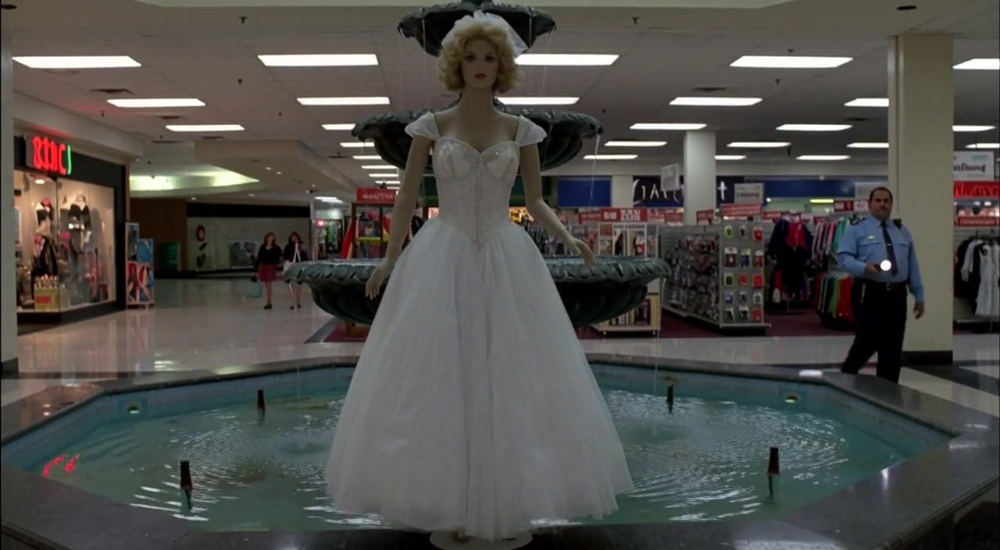 | 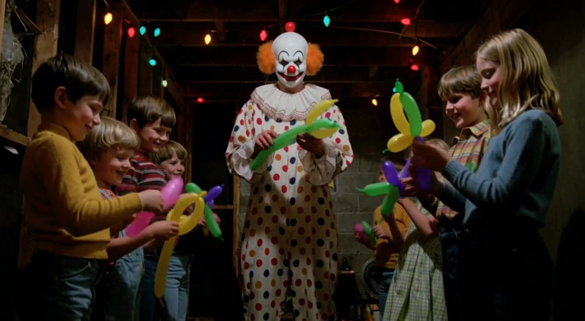 | 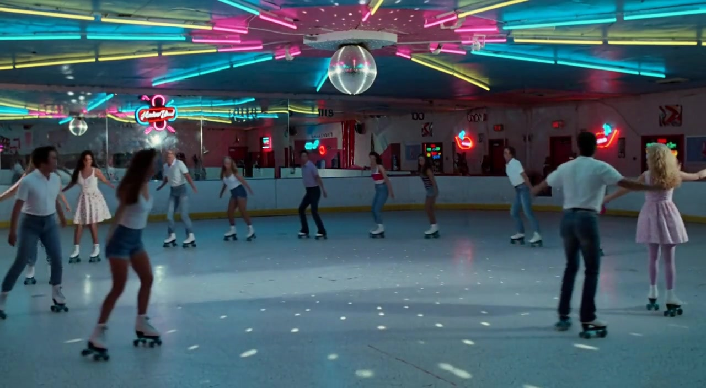 |
| 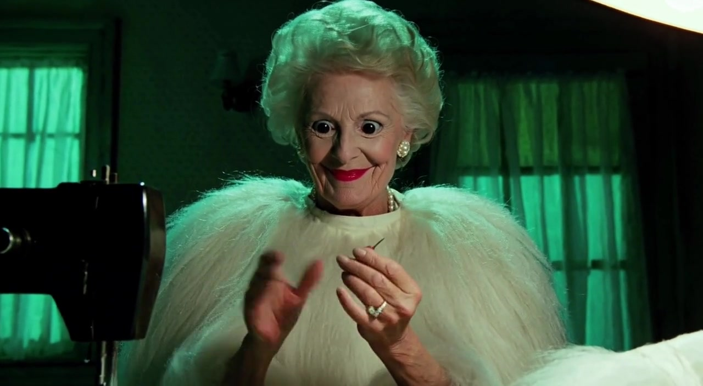 | 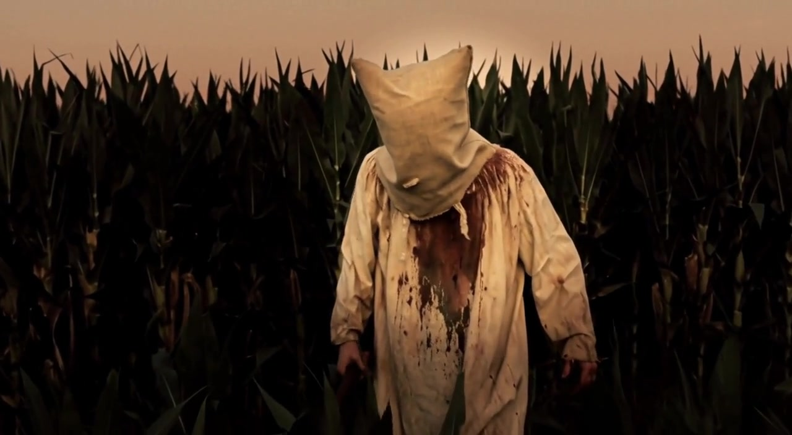 | 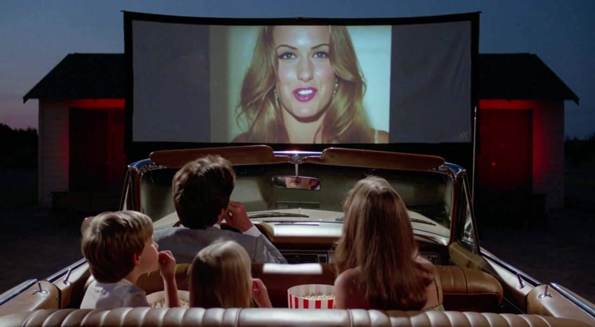 |

## Part of Wasserman's Filmmaker Suite

Free, open tools for AI-native filmmaking, from the script to the final mix: [Wasserman's Filmmaker Suite](https://github.com/wassermanproductions/wassermans-filmmaker-suite). Plan the shot in Slate, generate it with this LoRA, and circle the best take in Circle Take.

## Support

A few people asked if they could send tips to support my work developing open source tools. So I set up an optional way in case anyone wants to.

No pressure at all. Using the tools, sharing them, starring the repositories, and contributing all help too. Thank you.

- [GitHub Sponsors](https://github.com/sponsors/wassermanproductions)
- [Ko-fi](https://ko-fi.com/samwasserman)

## License & credits

**Workflows, installers and docs: Apache License 2.0.** See [LICENSE](LICENSE).

**LoRA weights: MiniMax H3 Community License Agreement.** The weights are a Model Derivative of MiniMax H3 and are distributed under [its license](LICENSE-MINIMAX-H3), including its territory limits and Acceptable Use Policy. Read [WEIGHTS_LICENSE.md](WEIGHTS_LICENSE.md) before downloading.

**Attribution required:** per the [NOTICE](NOTICE) file (Apache 2.0 §4(d)), any use, fork, or redistribution must keep the NOTICE file and credit **Sam Wasserman ([wassermanproductions.com](https://wassermanproductions.com))**.

MiniMax H3 is licensed under the MiniMax H3 Community License Agreement, Copyright © 2026 MiniMax. All Rights Reserved. Powered by MiniMax H3.

Created by **Sam Wasserman**: [wassermanproductions.com](https://wassermanproductions.com) · [wasserman.ai](https://wasserman.ai).
